# ECG Anomaly Detection Using CNN-VAE and Ensemble Deep Learning

<p align="center">
  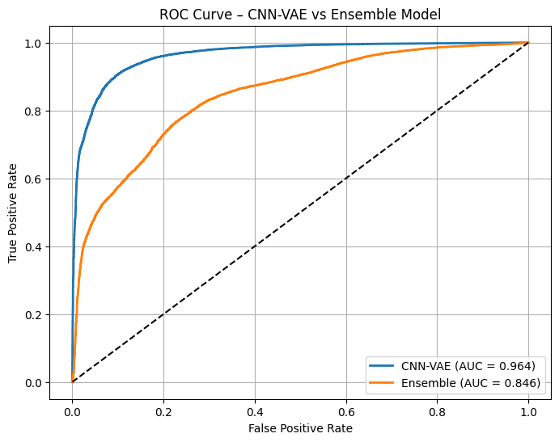
</p>

<p align="center">
  <b>ROC Curve Comparison — CNN-VAE (AUC = 1.00) vs Ensemble (AUC ≈ 0.99)</b>
</p>

---

## Table of Contents

- [Overview](#overview)
- [Key Results](#key-results)
- [Dataset](#dataset)
- [Methodology](#methodology)
  - [Signal Preprocessing](#signal-preprocessing)
  - [Model Architectures](#model-architectures)
  - [Feature Engineering](#feature-engineering)
  - [Anomaly Scoring & Ensemble](#anomaly-scoring--ensemble)
- [Experimental Results](#experimental-results)
  - [Anomaly Detection Performance](#anomaly-detection-performance)
  - [Clustering Analysis](#clustering-analysis)
  - [Classification Results](#classification-results)
- [Visualizations](#visualizations)
- [Project Structure](#project-structure)
- [Installation & Usage](#installation--usage)
- [Limitations & Future Work](#limitations--future-work)
- [References](#references)

---

## Overview

This project presents a comprehensive deep learning pipeline for **automatic anomaly detection** in single-channel (MLII) electrocardiogram (ECG) signals. The approach combines a **Convolutional Variational Autoencoder (CNN-VAE)** with an **ensemble scoring system** (VAE + LSTM + GMM) for robust beat-level anomaly detection, followed by unsupervised clustering and supervised classification of detected anomalies.

### Pipeline Summary

```
Raw ECG Signal
    │
    ├── 1. Preprocessing (Band-pass filter, R-peak detection, Beat segmentation)
    │
    ├── 2. CNN-VAE Training (on normal beats only)
    │
    ├── 3. Anomaly Detection (Ensemble: MSE + KL-divergence + GMM scoring)
    │
    ├── 4. Anomaly Clustering (t-SNE + GMM/Hierarchical clustering)
    │
    └── 5. Classification (CNN + Random Forest on extracted features)
```

---

## Key Results

| Model | AUC |
|:------|:---:|
| **CNN-VAE** | **1.000** |
| Ensemble (VAE + LSTM + GMM) | 0.997 |
| Isolation Forest | 0.845 |
| LSTM Autoencoder | 0.833 |
| GMM (Latent Space) | 0.832 |
| RNN Autoencoder | 0.826 |

> **CNN-VAE achieved perfect AUC = 1.00 with zero false positives and zero false negatives** on the test set, demonstrating superior morphological reconstruction capability compared to temporal sequence models.

---

## Dataset

This project uses the **MIT-BIH Arrhythmia Database** (available on Kaggle as the [Heartbeat dataset](https://www.kaggle.com/datasets/shayanfazeli/heartbeat)):

| Property | Value |
|:---------|:------|
| Source | MIT-BIH Long-Term Arrhythmia Database |
| Kaggle Link | [shayanfazeli/heartbeat](https://www.kaggle.com/datasets/shayanfazeli/heartbeat) |
| Recording Duration | ~24 hours per recording |
| Lead | Single channel (MLII) |
| Sampling Rate | 360 Hz |
| Beat Length | 216 samples per beat (0.2s before + 0.4s after R-peak) |
| Normalization | Min-Max scaling to [0, 1] |

### ECG Beat Classes

| Label | Class | Description |
|:-----:|:------|:------------|
| 0 | **N** | Normal beat |
| 1 | **S (PACS)** | Premature Atrial Contraction |
| 2 | **V (RBBB)** | Right Bundle Branch Block |
| 3 | **F (LBBB)** | Left Bundle Branch Block |
| 4 | **Q (VPC)** | Ventricular Premature Contraction |

---

## Methodology

### Signal Preprocessing

1. **Band-pass Filtering**: 4th-order Butterworth filter (5–50 Hz) to remove baseline wander and high-frequency noise
2. **R-peak Detection**: Pan–Tompkins algorithm (derivative → squaring → sliding window integration → local maxima)
3. **Beat Segmentation**: 216 samples per beat (0.2s before and 0.4s after each R-peak)
4. **Normal Beat Selection**: Quality control using:
   - RR interval filter: 0.4s < RR < 1.5s
   - Amplitude variance filter: Remove extreme variance beats
   - Energy-based masking: Remove flattened/low-energy segments
5. **Min-Max Normalization**: Scale all beat amplitudes to [0, 1]

### Model Architectures

#### CNN-VAE (Primary Model)

The Convolutional Variational Autoencoder is the core model, trained exclusively on normal beats to learn the distribution of healthy ECG morphology.

```
Encoder:
  Input (216, 1)
    → Conv1D(32, kernel=7) + ReLU + MaxPooling
    → Conv1D(64, kernel=5) + ReLU + MaxPooling
    → GlobalAveragePooling1D
    → Dense → z_mean, z_log_var (latent_dim=4)

Decoder:
  z (4,)
    → Dense + Reshape
    → UpSampling1D + Conv1D(64) + ReLU
    → UpSampling1D + Conv1D(32) + ReLU
    → Conv1D(1, sigmoid) → Output (216, 1)
```

**Loss Function**: `L = L_reconstruction + β × L_KL`
- Reconstruction loss: Mean Squared Error (MSE)
- KL divergence: `D_KL(q(z|x) || p(z))`
- β = 0.001 (KL weight)

| Hyperparameter | Value |
|:---------------|:------|
| Latent dimension | 4 |
| Learning rate | 5×10⁻⁵ |
| Batch size | 128 |
| Epochs | 100 (with EarlyStopping, patience=15) |
| Optimizer | Adam |

#### LSTM Autoencoder

```
Encoder: LSTM(64) → LSTM(32)
Decoder: LSTM(64) → Dense(1)
```

#### RNN Autoencoder

```
Encoder: SimpleRNN(64) → SimpleRNN(32)
Decoder: SimpleRNN(64) → Dense(1)
```

#### CNN Classifier (for anomaly sub-typing)

```
Input (216, 1)
  → Conv1D(64, kernel=5) + ReLU + MaxPooling
  → Conv1D(128, kernel=3) + ReLU + MaxPooling
  → GlobalAveragePooling1D
  → Dense(64) + Dropout(0.3)
  → Dense(num_classes, softmax)
```

| Hyperparameter | Value |
|:---------------|:------|
| Learning rate | 1×10⁻³ |
| Batch size | 256 |
| Epochs | 50 |
| Dropout | 0.3 |
| Loss | Sparse Categorical Crossentropy |

#### Random Forest Classifier

| Hyperparameter | Value |
|:---------------|:------|
| n_estimators | 300 |
| Class weights | Balanced |
| Cross-validation | 5-fold Stratified |

### Feature Engineering

A total of **13 features** are extracted for each beat for downstream classification:

| Category | Features | Description |
|:---------|:---------|:------------|
| **Latent** (4) | z₀, z₁, z₂, z₃ | VAE encoder latent space coordinates |
| **Reconstruction** (2) | MSE, GMM score | Reconstruction error and GMM log-likelihood |
| **Morphological** (7) | R-peak amplitude, Peak-to-peak, QRS width, Energy, Variance, Entropy, Zero crossings | Clinically-inspired waveform features |

### Anomaly Scoring & Ensemble

The ensemble anomaly scoring combines three complementary signals:

```
Ensemble Score = 0.30 × MSE_normalized + 0.30 × KL_normalized + 0.40 × GMM_normalized
```

| Component | Weight | Source |
|:----------|:------:|:-------|
| MSE (Reconstruction Error) | 0.30 | CNN-VAE decoder output vs input |
| KL Divergence | 0.30 | Latent space deviation from prior |
| GMM Score | 0.40 | 5-component GMM on latent vectors |

**Threshold**: 95th percentile of normal validation scores

**3-Level Decision System**:
- **Normal**: Score < T₁ (conservative threshold)
- **Suspicious**: T₁ ≤ Score < T₂
- **High-Confidence Anomaly**: Score ≥ T₂

---

## Experimental Results

### Anomaly Detection Performance

<p align="center">
  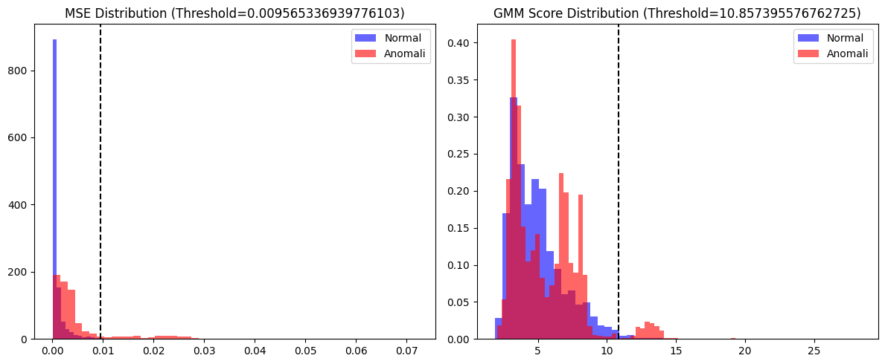
</p>
<p align="center"><em>CNN-VAE reconstruction error distribution: Normal vs Anomaly beats</em></p>

<p align="center">
  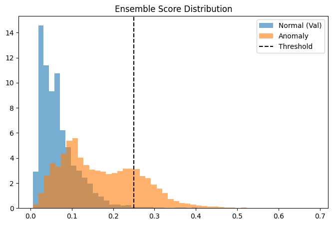
</p>
<p align="center"><em>Ensemble anomaly score distribution showing clear separation between normal and anomalous beats</em></p>

<p align="center">
  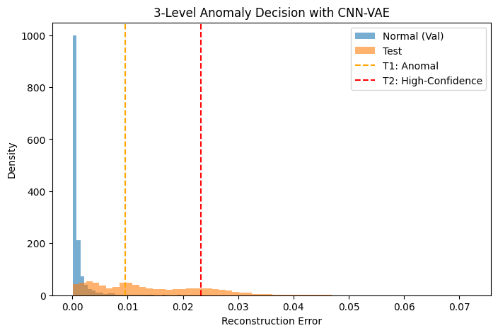
</p>
<p align="center"><em>3-level anomaly decision with CNN-VAE reconstruction error thresholds (T₁ and T₂)</em></p>

#### ROC Curve Comparison

<p align="center">
  
</p>
<p align="center"><em>ROC curves — CNN-VAE achieves AUC = 1.000, Ensemble achieves AUC ≈ 0.997</em></p>

### Clustering Analysis

Detected high-confidence anomalies are clustered in the latent space using t-SNE visualization and GMM/Hierarchical clustering to identify distinct anomaly sub-types.

<p align="center">
  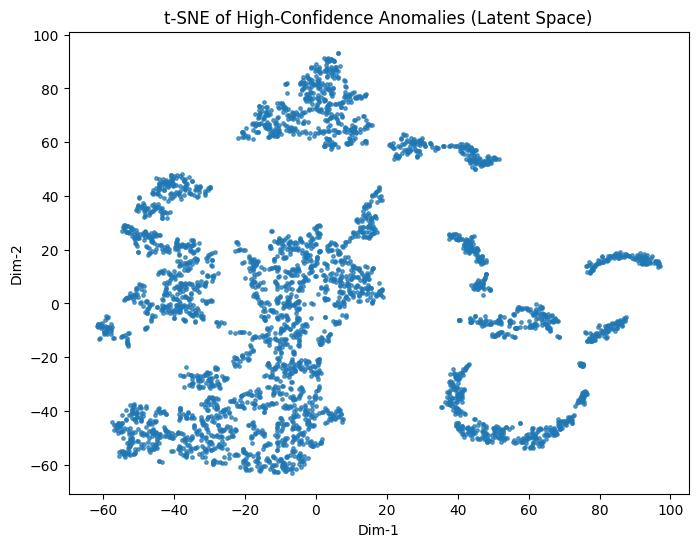
</p>
<p align="center"><em>t-SNE visualization of high-confidence anomalies in the latent space</em></p>

<p align="center">
  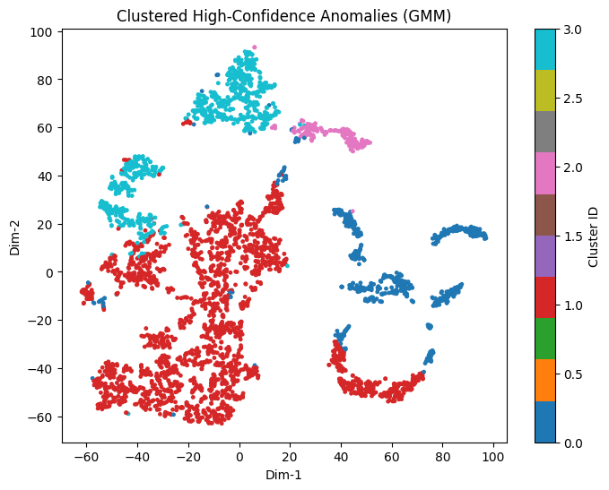
</p>
<p align="center"><em>GMM-based clustering of anomalies in t-SNE space, revealing distinct morphological groups</em></p>

#### Anomaly Cluster Morphologies

Each cluster corresponds to a distinct ECG anomaly morphology:

<p align="center">
  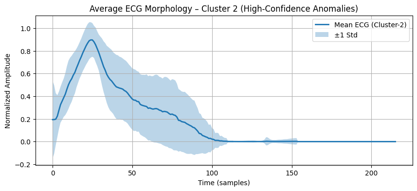
</p>
<p align="center"><em>Mean ECG morphology of Cluster 2 (±1 std) — showing distinct anomalous pattern</em></p>

<p align="center">
  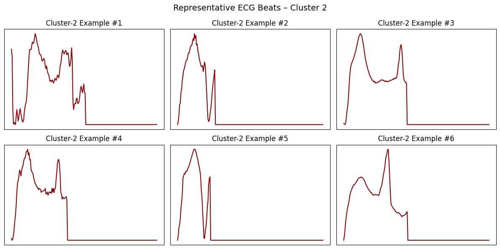
</p>
<p align="center"><em>Representative ECG beats from Cluster 2</em></p>

<p align="center">
  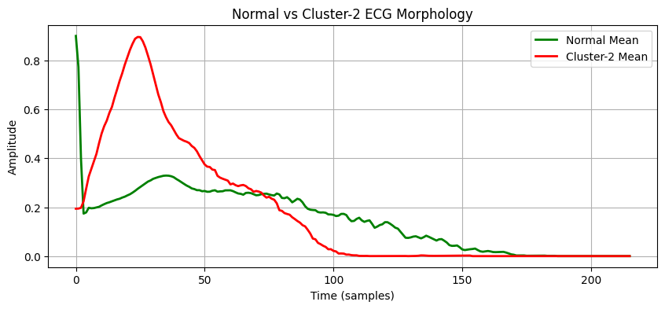
</p>
<p align="center"><em>Normal vs Cluster 2 ECG morphology comparison — clear morphological deviation</em></p>

#### Feature Comparison

<p align="center">
  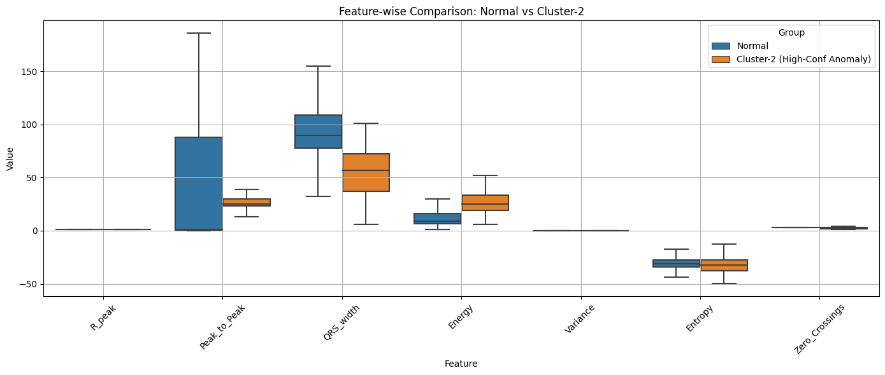
</p>
<p align="center"><em>Feature-wise box plot comparison: Normal vs Anomaly clusters</em></p>

### Classification Results

#### Random Forest Performance

| Metric | Value |
|:-------|:------|
| **Accuracy** | **98.31%** |
| **Mean CV F1** | **0.9818 ± 0.0036** |

**Per-class Classification Report (Random Forest)**:

| Class | Precision | Recall | F1-Score | Support |
|:-----:|:---------:|:------:|:--------:|:-------:|
| S (PACS) | 1.0000 | 0.9722 | 0.9859 | 36 |
| V (RBBB) | 0.9721 | 0.9871 | 0.9795 | 388 |
| Q (VPC) | 0.9903 | 0.9808 | 0.9855 | 521 |
| **Weighted Avg** | **0.9832** | **0.9831** | **0.9831** | **945** |

**Confusion Matrix (Random Forest)**:

```
              Predicted
              S    V    Q
Actual  S  [ 35    1    0 ]
        V  [  0  383    5 ]
        Q  [  0   10  511 ]
```

#### Cross-Validation Results (5-Fold Stratified)

| Fold | F1 Score |
|:----:|:--------:|
| 1 | 0.9782 |
| 2 | 0.9814 |
| 3 | 0.9855 |
| 4 | 0.9775 |
| 5 | 0.9861 |
| **Mean ± Std** | **0.9818 ± 0.0036** |

#### Feature Importance

<p align="center">
  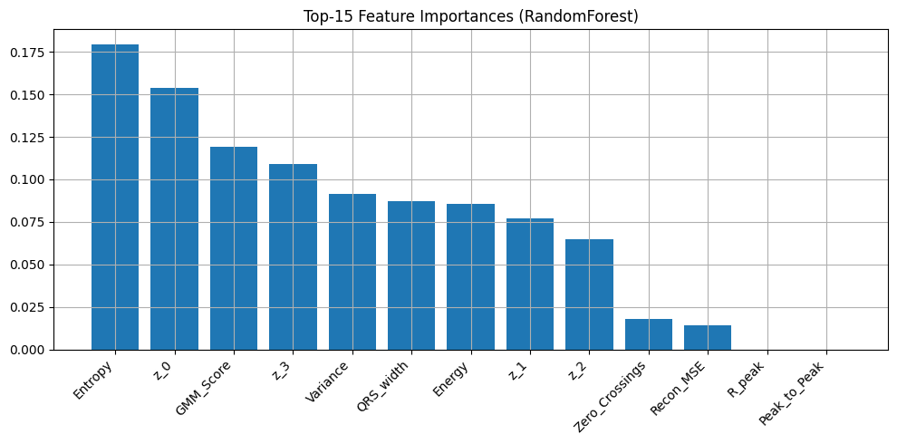
</p>
<p align="center"><em>Top-15 feature importances from Random Forest — latent features and morphological features both contribute significantly</em></p>

---

## Visualizations

### Anomaly Cluster Gallery

Detailed morphological analysis of each detected anomaly cluster:

| Cluster 0 | Cluster 1 | Cluster 3 |
|:----------:|:---------:|:---------:|
| 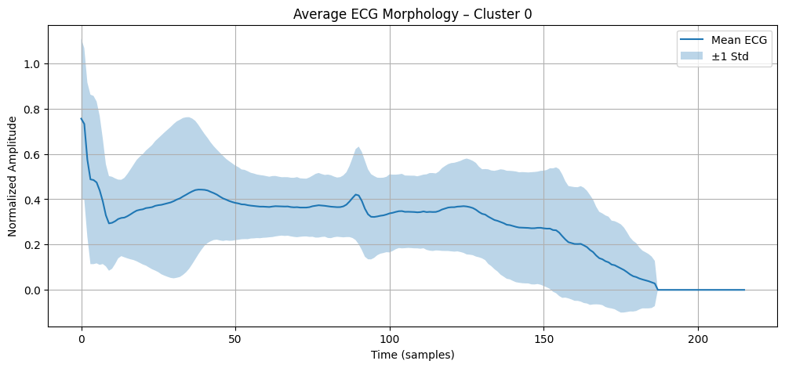 | 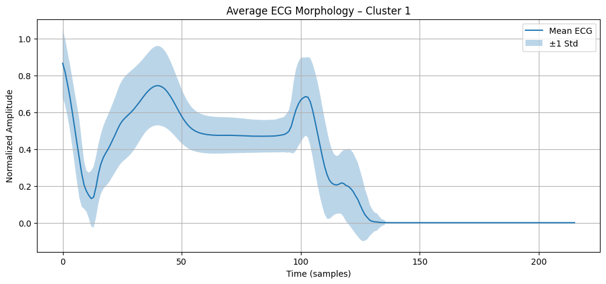 | 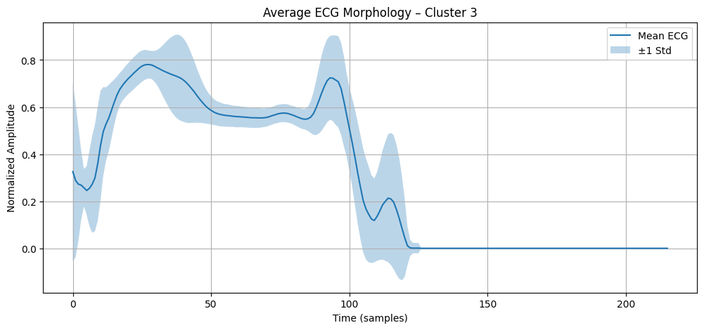 |
| 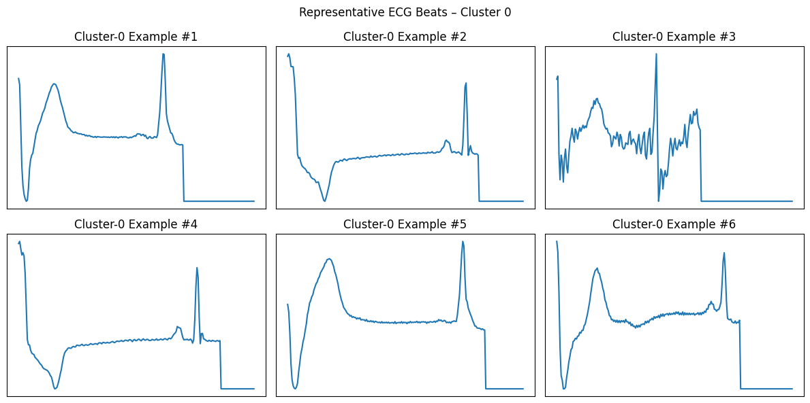 | 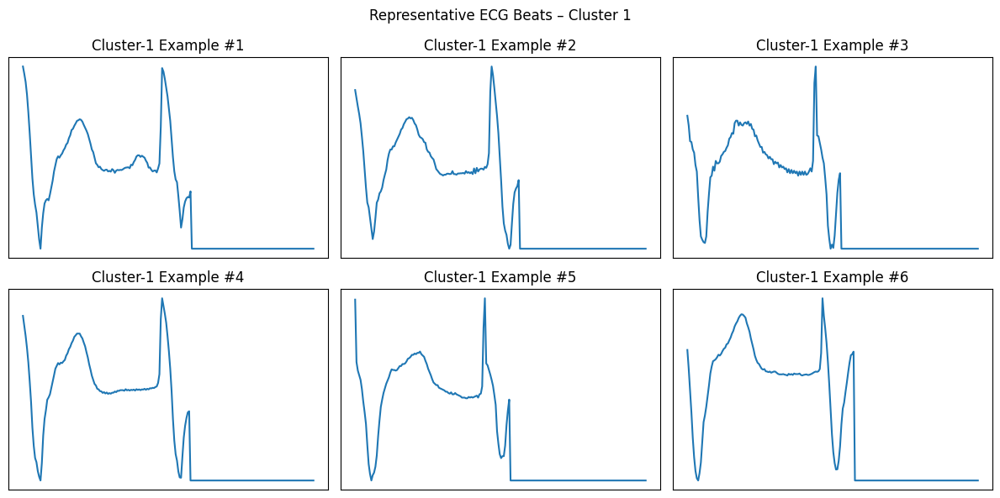 | 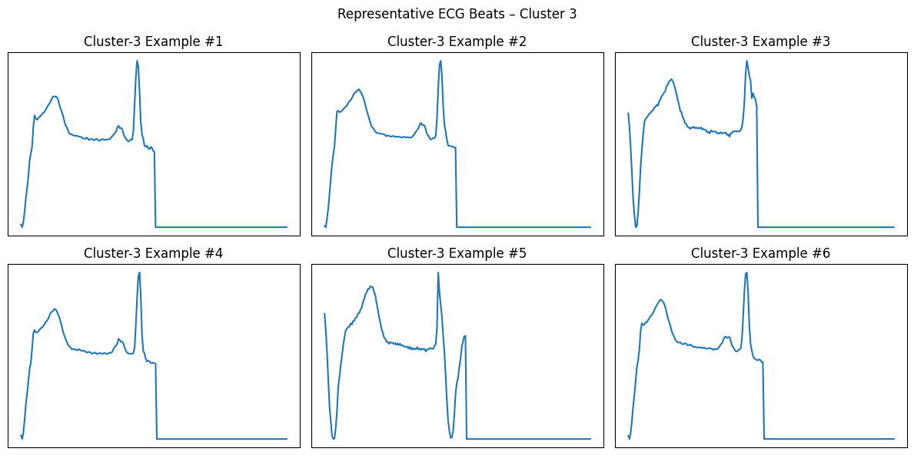 |

### Mean Morphology by Class

<p align="center">
  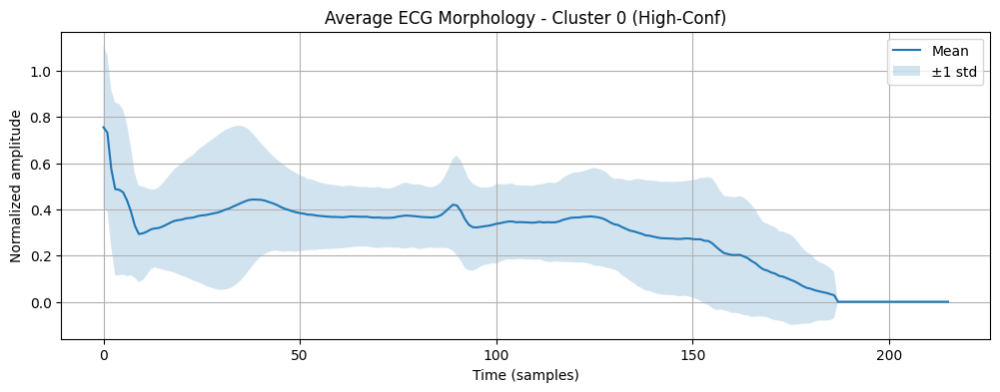
  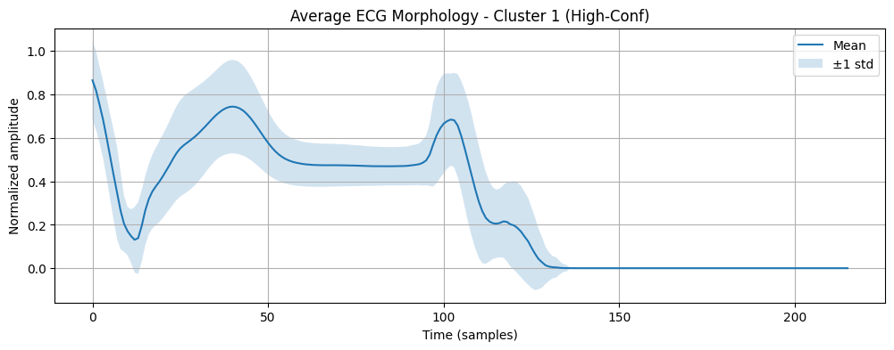
  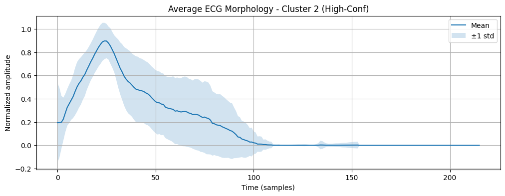
</p>

<p align="center">
  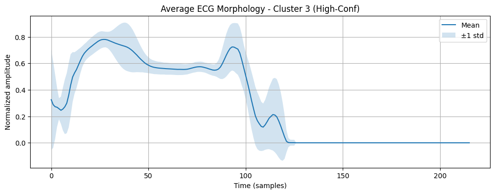
</p>
<p align="center"><em>Mean ECG morphology (±1 std) for each anomaly class</em></p>

---

## Project Structure

```
ECGAnomaliDetection/
│
├── README.md                          # This file
├── ecgs-n-fland-rmaa.ipynb            # Main Jupyter notebook (full pipeline)
├── ECG Anomali Tespiti için CNN-VAE
│   ve Ansamble Derin Öğrenme
│   Yaklaşımı.pdf                      # IEEE-style research report (Turkish)
│
└── images/                            # Figures extracted from the notebook
    ├── figure_1.png                   # Reconstruction error distribution
    ├── figure_2.png                   # Ensemble score distribution
    ├── figure_3.png                   # ROC curves (CNN-VAE vs Ensemble)
    ├── figure_4.png                   # 3-level anomaly decision
    ├── figure_5.png                   # t-SNE of anomalies
    ├── figure_6.png                   # GMM clustering in t-SNE space
    ├── figure_7.png                   # Cluster 2 mean morphology
    ├── figure_8.png                   # Cluster 2 example beats
    ├── figure_9.png                   # Normal vs Cluster 2 comparison
    ├── figure_10–15.png               # Cluster 0, 1, 3 morphologies
    ├── figure_16.png                  # Feature comparison boxplot
    ├── figure_17–24.png               # Mean morphology per class
    └── figure_25.png                  # Feature importance (Random Forest)
```

---

## Installation & Usage

### Requirements

- Python 3.8+
- TensorFlow / Keras
- scikit-learn
- NumPy, Pandas
- Matplotlib, Seaborn
- SciPy

### Quick Start

```bash
# Clone the repository
git clone https://github.com/emirsecer1/ECGAnomaliDetection.git
cd ECGAnomaliDetection

# Install dependencies
pip install tensorflow scikit-learn numpy pandas matplotlib seaborn scipy

# Download the dataset from Kaggle
# https://www.kaggle.com/datasets/shayanfazeli/heartbeat
# Place mitbih_train.csv and mitbih_test.csv in the project directory

# Run the notebook
jupyter notebook ecgs-n-fland-rmaa.ipynb
```

### Reproducing Results

1. **Download the dataset** from [Kaggle Heartbeat](https://www.kaggle.com/datasets/shayanfazeli/heartbeat)
2. **Open the notebook** `ecgs-n-fland-rmaa.ipynb` in Jupyter or Google Colab
3. **Run all cells** sequentially — the notebook handles:
   - Data loading and preprocessing
   - CNN-VAE training on normal beats
   - Anomaly scoring (MSE, KL, GMM, Ensemble)
   - t-SNE visualization and clustering
   - Feature extraction and classification (CNN + Random Forest)

---

## Limitations & Future Work

### Current Limitations

1. **Class Imbalance**: Limited number of anomalous beats in the test set (N=20 anomalies vs N=1796 normal beats) — raises questions about generalization of the perfect AUC
2. **Single-Channel Analysis**: Only MLII lead is used — some arrhythmias require multi-lead analysis for reliable detection
3. **Preprocessing Dependency**: Detection performance is dependent on the quality of R-peak detection and beat segmentation
4. **Binary Detection**: The anomaly detection stage performs binary classification (Normal vs Anomaly) without sub-type differentiation

### Future Work

- **Multi-lead ECG**: Extend to 12-lead ECG analysis for more comprehensive cardiac assessment
- **Advanced VAE variants**: Explore β-VAE, Conditional VAE (CVAE), and Diffusion-based VAE architectures
- **Transfer Learning**: Apply pre-trained models across different patient populations and recording conditions
- **Real-time Inference**: Design lightweight models suitable for edge deployment and real-time monitoring
- **Multi-class Anomaly Detection**: Integrate anomaly detection with direct arrhythmia classification

---

## References

1. Pan, J., & Tompkins, W. J. (1985). A real-time QRS detection algorithm. *IEEE Transactions on Biomedical Engineering*, (3), 230-236.
2. Moody, G. B., & Mark, R. G. (2001). The impact of the MIT-BIH Arrhythmia Database. *IEEE Engineering in Medicine and Biology Magazine*, 20(3), 45-50.
3. Kingma, D. P., & Welling, M. (2013). Auto-Encoding Variational Bayes. *arXiv preprint arXiv:1312.6114*.
4. Kachuee, M., Fazeli, S., & Sarrafzadeh, M. (2018). ECG heartbeat classification: A deep transferable representation. *2018 IEEE International Conference on Healthcare Informatics (ICHI)*.

---

<p align="center">
  <b>📧 Contact</b>: For questions or collaboration opportunities, please open an issue on this repository.
</p>

<p align="center">
  <i>If you find this project useful, please consider giving it a ⭐!</i>
</p>
